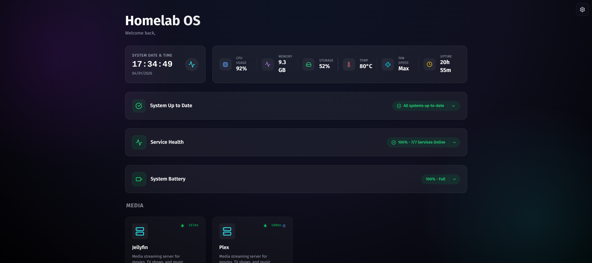
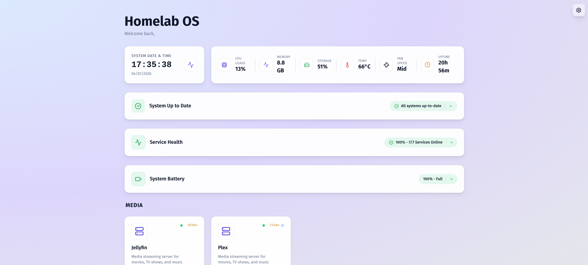

# Homelab Dashboard

A secure, premium, and customizable dashboard for your local home server. Built with Next.js 15, React 19, Tailwind CSS 4, and Framer Motion.



## ✨ Features

- 🚀 **Centralized Hub**: Single entry point for all your local services with optimized state management via React Context
- 🎨 **Premium Design**: "Deep Space" theme with glassmorphism, animated backgrounds, and interactive hover effects
- ⚡ **Optimized Monitoring**: High-performance system stats (CPU, GPU, RAM, Temperature, Fan Speed) using a centralized polling architecture
- 🔄 **System Update Monitoring**: Track available OS updates and security patches with one-click package listing
- 🏥 **Resilient Health Checks**: Real-time monitoring with "Internal-to-Public" fallback logic and tiered timeouts
- 🔋 **Battery Information**: Real-time battery status, health, and power metrics (Docker-compatible via host mounts)
- 💾 **Storage Monitoring**: Configurable multi-drive storage display with automatic detection of mounted drives
- ⏰ **Customizable Clock**: Toggle between 12-hour and 24-hour time formats with persistent preferences
- 🐳 **Docker Integration**: Includes Docker Compose setup for essential homelab services
- 🛡️ **Connectivity Transparency**: Visual markers (Globe icon) indicating when services are using fallback public routes
- 🔒 **Secure Configuration**: Service URLs configured via environment variables with SSL verification bypass for internal Docker traffic
- 📱 **Responsive Design**: Optimized for desktop, tablet, and mobile devices
- 🛠️ **Easy Customization**: Simple configuration file and component architecture

## 📦 What's Included

This project includes two main components:

1. **Next.js Dashboard** - The web interface for monitoring and accessing your services
2. **Docker Services** - Pre-configured Docker Compose setup for essential homelab services

### Included Services

**Media Streaming:**
- **Plex Media Server** - Media streaming server
- **Jellyfin** - Open-source media streaming server

**Media Management (ARR Stack):**
- **Sonarr** - TV show collection manager
- **Radarr** - Movie collection manager
- **Prowlarr** - Indexer manager for Sonarr/Radarr
- **qBittorrent** - Torrent download client
- **Jellyseerr** - Media request manager

**Photos & Storage:**
- **Immich** - Self-hosted photo and video management
- **Filebrowser** - Web-based file manager for your drives

**Network:**
- **Nginx Proxy Manager** - Reverse proxy with SSL/TLS management
- **Pi-hole** - Network-wide ad blocking and DNS server

**AI:**
- **Open WebUI** - Web interface for AI/LLM interactions

**System:**
- **Portainer** - Docker container management UI
- **Cockpit** - Web-based server administration interface
- **Watchtower** - Automated Docker container updates (scheduled weekly on Sundays at 3 AM)

See the [docker-services README](./docker-services/README.md) for detailed documentation on these services.

## 🚀 Quick Start

### Prerequisites

- **Node.js** 18+ and npm/yarn/pnpm
- **Docker** and **Docker Compose** (for running services)

### Installation

1. **Clone the repository**:
   ```bash
   git clone https://github.com/ChaitanyaDhiman/homelab-web.git
   cd homelab-web
   chmod +x start-homelab.sh
   ```

2. **Install dependencies**:
   ```bash
   npm install
   ```

3. **Configure your services**:
   ```bash
   cp .env.example .env.local
   ```
   
   Edit `.env.local` to add your service URLs:
   ```env
   NEXT_PUBLIC_SERVICE_PLEX_URL=http://192.168.xx.xx:32400/web
   NEXT_PUBLIC_SERVICE_JELLYFIN_URL=http://192.168.xx.xx:8096
   NEXT_PUBLIC_SERVICE_PIHOLE_URL=http://192.168.xx.xx/admin
   NEXT_PUBLIC_SERVICE_PORTAINER_URL=http://192.168.xx.xx:9443
   NEXT_PUBLIC_SERVICE_OPENWEBUI_URL=http://192.168.xx.xx:8080
   NEXT_PUBLIC_SERVICE_FILEBROWSER_URL=http://192.168.xx.xx:8085
   NEXT_PUBLIC_SERVICE_IMMICH_URL=http://192.168.xx.xx:2283
   NEXT_PUBLIC_SERVICE_COCKPIT_URL=http://192.168.xx.xx:9090
   NEXT_PUBLIC_SERVICE_NPM_URL=http://192.168.xx.xx:82
   # ... add your specific IPs/Ports
   ```

4. **Run the development server**:
   ```bash
   npm run dev
   ```

   Open [http://localhost:3000](http://localhost:3000) to view your dashboard.

## 🐳 Docker Deployment

### Option 1: Dashboard Only

Deploy just the Next.js dashboard:

```bash
docker-compose up -d --build
```

The dashboard will be available on port `3000` (internal, exposed via proxy).

### Option 2: Full Stack (Recommended)

The easiest way to deploy the dashboard along with all homelab services is using the included helper script. This handles network creation and starts services in the correct order.

```bash
./start-homelab.sh
```

This script will:
1. Create the necessary Docker network (`proxy_net`)
2. Start networking services (Nginx Proxy Manager, Pi-hole)
3. Start core services (Plex, Jellyfin, Portainer, Open WebUI)
4. Build and start the Next.js dashboard

### Manual Full Stack Deployment

If you prefer to start services manually:

1. **Create the network**:
   ```bash
   docker network create proxy_net || true
   ```

2. **Start the dashboard**:
   ```bash
   docker-compose up -d --build
   ```

   **Note for Battery/Updates Features in Docker**:
   The `docker-compose.yml` mounts specific host paths (`/sys/class/power_supply`, `/var/run/reboot-required`, etc.) to allow the container to read host battery status and update information. Ensure your user has read permissions for these paths.

3. **Start the services**:
   ```bash
   cd docker-services
   # Visit each service directory and update configurations
   docker-compose -f nginx-proxy-manager/docker-compose.yml up -d
   # ... repeat for other services
   ```

4. **Configure Nginx Proxy Manager**:
   - Access admin UI at `http://localhost:82`
   - Default credentials: `admin@example.com` / `changeme`
   - Set up proxy hosts for your services (see [docker-services README](./docker-services/README.md))

### SSL/TLS Configuration

For secure access with HTTPS:

1. **Using Let's Encrypt** (for public domains):
   - Configure in Nginx Proxy Manager UI
   - Automatic certificate renewal

2. **Using Self-Signed Certificates** (for local domains):
   ```bash
   openssl req -x509 -nodes -days 365 -newkey rsa:2048 \
     -keyout self-signed.key -out self-signed.crt \
     -subj "/CN=docker.mylocalserver.com"
   ```
   Upload as "Custom Certificate" in Nginx Proxy Manager.

## 📁 Project Structure

```
homelab-web/
├── app/                      # Next.js app directory
│   ├── api/                  # API routes (health, system, storage, updates)
│   ├── config/               # Configuration files
│   │   ├── services.ts       # Service definitions
│   │   └── storage.ts        # Storage drive configuration
│   └── globals.css           # Global styles & theme
├── components/               # React components
│   ├── dashboard/            # Dashboard widgets (HealthSummary, StorageWidget, SystemUpdateStatus)
│   ├── icons/                # Custom icons (OllamaIcon)
│   └── ui/                   # Reusable UI elements
├── contexts/                 # Centralized state management
│   ├── HealthContext.tsx     # Service health polling
│   ├── SystemContext.tsx     # System stats polling
│   └── SettingsContext.tsx   # User preferences
├── docker-services/          # Docker services configuration
├── start-homelab.sh          # Deployment helper script
├── docker-compose.yml        # Dashboard compose file
└── README.md                 # This file
```

## ⚙️ Configuration

### Adding New Services

1. **Add environment variable** in `.env.local`:
   ```env
   NEXT_PUBLIC_SERVICE_NEWAPP_URL=http://localhost:1234
   ```

2. **Update service configuration** in `app/config/services.ts`:
   ```typescript
   import { Layout } from "lucide-react"; // Choose an icon

   export const services: Service[] = [
     // ... existing services
     {
       id: "new-app",
       name: "My New App",
       description: "Description of the app",
       url: process.env.NEXT_PUBLIC_SERVICE_NEWAPP_URL || "/unavailable?service=new-app",
       icon: Layout,
       category: "system", // 'media' | 'system' | 'dev' | 'network' | 'ai' | 'storage' | 'media management'
       status: "online",
     },
   ];
   ```

### Configuring Storage Drives

Edit `app/config/storage.ts` to configure which drives are displayed:

```typescript
export const storageDrives: StorageDrive[] = [
  {
    id: "main",
    name: "main",
    label: "Main Storage",
    mount: "/",           // Root partition
    icon: Server,
  },
  {
    id: "cloud",
    name: "cloud",
    label: "Cloud Storage",
    mount: "/mnt/cloud",  // Your cloud mount point
    icon: Cloud,
  },
  {
    id: "media",
    name: "media",
    label: "Media Storage",
    mount: "/mnt/media",  // Your media drive mount point
    icon: Film,
  },
];
```

Only drives that are actually present on the system will be displayed.

### Customizing the Theme

Edit CSS variables in `app/globals.css`:

```css
:root {
  --primary: #00f0ff;
  --secondary: #bd00ff;
  /* ... other variables */
}
```

The dashboard uses [Lucide React](https://lucide.dev) for icons - browse their library to find the perfect icon for your services.

## 🎨 Theming System

The dashboard features a robust dual-theme system built for aesthetics and usability:

- **Dark Theme**: The default immersive theme featuring deep violet/blue gradients, neon accents, and glowing glass panels. Optimized for late-night maintenance sessions.
- **Light Theme**: A polished, professional light theme using soft pastel gradients and high-contrast text for excellent readability in bright environments.


- **Glassmorphism**: Both themes utilize advanced backdrop filters, semi-transparent layers, and subtle borders to create a modern, layered depth effect.
- **Smooth Transitions**: All theme changes are animated with smooth 300ms transitions for background colors, borders, and text.

## 📊 System Monitoring

The dashboard includes real-time system monitoring using a high-performance polling architecture:

- **Centralized Polling**: Single `/api/system` call every 5 seconds shared across all components via `SystemContext`.
- **CPU**: Current usage percentage and load average.
- **GPU**: Utilization percentage, memory usage, and temperature (NVIDIA/AMD support via `systeminformation`).
- **RAM**: Active memory usage with total available.
- **Temperature**: Average temperature of all CPU cores.
- **Fan Speed**: System fan speed monitoring.
- **Storage**: Usage of configured drives via `/api/storage` with automatic detection.
- **Battery**: Detailed power metrics including charge %, health status, voltage, and power draw (requires `/sys` mount in Docker).
- **Uptime**: System uptime in human-readable format.

## 🔄 System Update Monitoring

The dashboard monitors host system updates managed by **Unattended Upgrades (APT)**:

- **Automated Management**: Leverages system-level `unattended-upgrades` to keep the host OS patched and secure.
- **Urgency Awareness**: Badges change color based on urgency:
  - 🔴 **Critical**: Security updates available
  - 🟡 **Warning**: 5+ regular updates pending
  - 🔵 **Normal**: Pending minor updates
- **Reboot Detection**: Clear visual alerts when a kernel or system reboot is required
- **Deep Dive**: Click to expand for a detailed list of regular vs. security packages.
- **Live Background Polish**: Download icon pulses when new updates are ready.
- **Dashboard API**: Integrates via a dedicated `/api/updates` endpoint that surfaces real-time update metadata.

## 🏥 Service Health Monitoring

The dashboard includes comprehensive real-time health monitoring for all configured services:

### Features

- **Centralized Health Check**: Single `/api/health` fetch every 30 seconds managed by `HealthContext`.
- **Intelligent Fallback**: Attempts internal Docker networking first, falling back to public URLs with tiered timeouts (2s internal / 3s public) for maximum reliability in both dev and production.
- **Response Time Tracking**: Color-coded response times for performance insights:
  - 🟢 Green: < 200ms (Excellent)
  - 🟡 Yellow: 200-500ms (Good)
  - 🟠 Orange: 500-2000ms (Slow)
  - 🔴 Red: > 2000ms (Degraded)
- **Status Markers**: Visual indicators including a 🌐 marker for fallback connections and status bubbles on each service card.
- **Health Summary Widget**: Expandable overview showing:
  - Overall health percentage
  - Count of online, degraded, and offline services
  - Animated progress bar with color-coded health states

## 🖥️ Cockpit Server Management

Access comprehensive server management through Cockpit:

- Web-based server administration interface
- Real-time system monitoring and metrics
- Service management and logs viewer
- Terminal access directly in the browser
- Storage and network configuration
- Integrated with your homelab services

**Note**: Running Cockpit directly on the host system is recommended over Docker for full functionality.

## 🛠️ Development

### Available Scripts

```bash
npm run dev      # Start development server
npm run build    # Build for production
npm start        # Start production server (port 3000)
npm run lint     # Run ESLint
```

### Tech Stack

- **Framework**: Next.js 15 (App Router)
- **React**: 19
- **Styling**: Tailwind CSS 4
- **Animations**: Framer Motion 12
- **Icons**: Lucide React
- **Server Management**: Cockpit
- **System Info**: systeminformation
- **TypeScript**: Full type safety

## 🔒 Security Best Practices

- Change all default passwords immediately after deployment
- Use SSL/TLS certificates for all services
- Restrict access to admin interfaces
- Keep all services updated regularly (Watchtower handles this automatically)
- Use strong passwords and consider implementing authentication
- Review Pi-hole logs for suspicious DNS queries
- Limit external access to services that don't need it

## 🐛 Troubleshooting

### Dashboard Won't Start

```bash
# Check logs
docker-compose logs nextjs-dashboard

# Rebuild container
docker-compose up -d --build --force-recreate
```

### Services Not Accessible

- Verify service URLs in `.env.local`
- Check that services are running: `docker ps`
- Ensure network connectivity between containers
- Check Nginx Proxy Manager configuration

### System Stats Not Loading

- Ensure the dashboard has proper permissions to read system info
- Check `/api/system` endpoint in browser DevTools
- Verify `systeminformation` package is installed
- For GPU stats, ensure you have NVIDIA/AMD drivers installed

### Storage Drives Not Showing

- Check that the mount points in `app/config/storage.ts` match your actual mounts
- Verify the drives are mounted: `df -h`
- Only drives that are actually present will be displayed

### Cockpit Not Accessible

- Verify Cockpit service is running on the host or in Docker
- Check Nginx Proxy Manager configuration for Cockpit
- Ensure port 9090 (host) or 4200 (Docker) is not blocked by firewall
- Check logs: `systemctl status cockpit` (host) or `docker logs cockpit` (Docker)

## 📚 Additional Resources

- [Next.js Documentation](https://nextjs.org/docs)
- [Tailwind CSS Documentation](https://tailwindcss.com/docs)
- [Framer Motion Documentation](https://www.framer.com/motion/)
- [Docker Services Documentation](./docker-services/README.md)
- [Nginx Proxy Manager Guide](https://nginxproxymanager.com/guide/)

## 🤝 Contributing

Contributions are welcome! Please feel free to submit a Pull Request.

## 📝 License

MIT License - feel free to use this project for your own homelab!

## 🙏 Acknowledgments

- Built with modern web technologies
- Inspired by the homelab community
- Icons by [Lucide](https://lucide.dev)

---

**Made with ❤️ for homelabbers**
